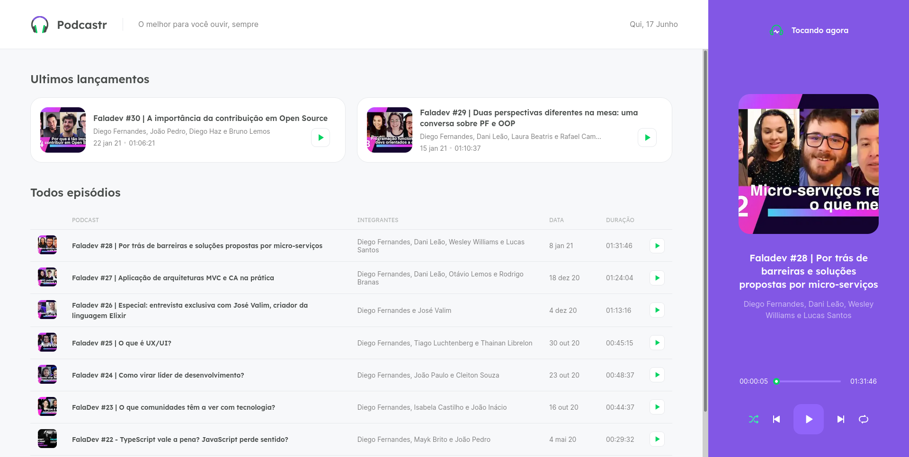

<h1 align="center">
    
    <br>
</h1>

<p align="center">
  <a href="https://www.linkedin.com/in/roger-fernandes-1488841b9/">
    
  </a>

  <a href="./LICENSE"> 
    
  </a>
</p>

<h4 align="center">
  This is a project developed at NLW4 by <a href="https://github.com/Rocketseat/">Rocketseat </a>.
</h4>


<p align="center">
  <a href="#ledger-about">About</a>&nbsp;&nbsp;&nbsp;|&nbsp;&nbsp;&nbsp;
  <a href="#running-starting">Starting</a>&nbsp;&nbsp;&nbsp;|&nbsp;&nbsp;&nbsp;
  <a href="#computer-technologies">Technologies</a>&nbsp;&nbsp;&nbsp;|&nbsp;&nbsp;&nbsp;
  <a href="#memo-license">License</a>
</p>




## :ledger: About
This is an application to run podcasts, with the following features:

- Play podcast;
- Pause podcast;
- Next podcast;
- Previous podcast;
- Suffle podcasts;
- Back podcast;

## :running: Starting

Before starting :checkered_flag:, you need to have installed:
- [Git](https://git-scm.com) 
- [Node](https://nodejs.org/en/)
- [Yarn](https://classic.yarnpkg.com/en/)

```bash
# Clone this project
$ git clone https://github.com/rogeraf15/podcastr

# Access
$ cd podcastr

# Install dependencies
$ yarn

# Run fake Api
$ yarn server

# Run the project
$ yarn dev

# The server will initialize in the <http://localhost:3000>
```

## :computer: Technologies

- [NextJS](https://nextjs.org/)
- [Typescript](https://www.typescriptlang.org/)
- [Sass](https://sass-lang.com/)
- [rc-slider](https://github.com/schrodinger/rc-slider)
- [Axios](https://github.com/axios/axios)
- [JSON Server](https://github.com/typicode/json-server)


## :memo: License

This project is under the MIT license. See the [LICENSE](./LICENSE) for more information.

---

Made with ♥ by Roger Fernandes :wave: [Get in touch!](https://www.linkedin.com/in/roger-fernandes-1488841b9/)

